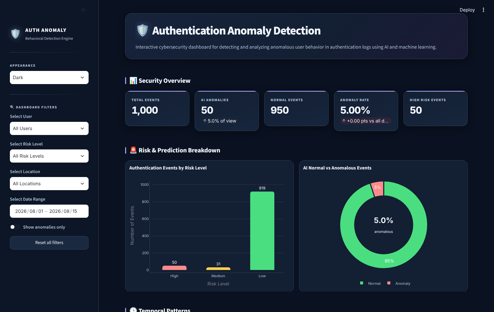
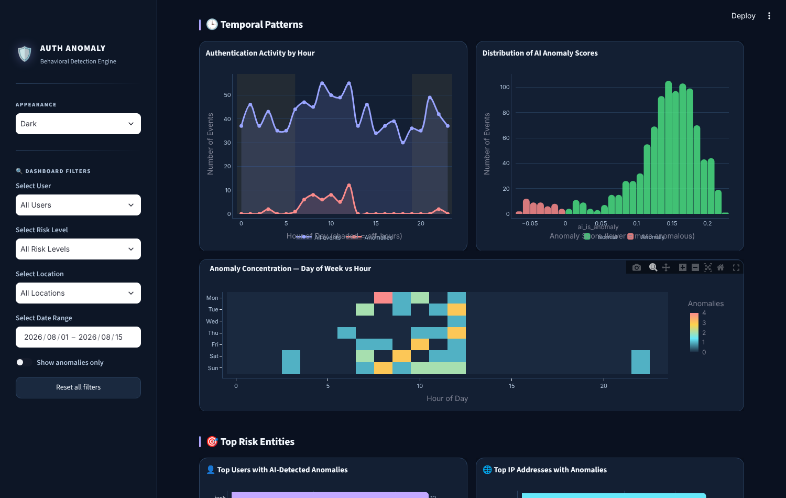

# Anomalous User Behavior Detection in Authentication Logs

An end-to-end security analytics project that finds unusual login behavior in authentication logs, using SQL, feature engineering and an Isolation Forest model, with an interactive dashboard for investigation.

Built with Python, SQL (SQLite), scikit-learn and Streamlit.



## What it does

- Stores authentication events in SQLite and profiles them with SQL
- Engineers 18 behavioral features per login event
- Scores every event with an Isolation Forest model and assigns a risk level
- Lets an analyst filter by user, risk level, location and date in a dashboard

Typical behavior it surfaces: logins at unusual hours, repeated failed attempts, one account used from many IP addresses, devices or locations, and one IP address or device used by many accounts.

## Results on the sample data

| Measure | Value |
|---|---|
| Authentication events | 1,000 |
| Events flagged as anomalous | 50 (5.0%) |
| High-risk events | 50 |
| Medium-risk events | 31 |
| Low-risk events | 919 |

The dataset is synthetic. It is generated by `src/01_create_dataset.py` and contains no real users or systems.

## How it works

```text
Authentication logs  →  SQLite analysis  →  Feature engineering  →  Isolation Forest  →  Dashboard
```

| Stage | Detail |
|---|---|
| SQL analysis | Login volumes, failure rates and activity by user, IP address, device and location |
| Feature engineering | Time features (hour, weekday, weekend, night), success and failure counts, and how widely each user, IP address, device and location is shared |
| Model | Isolation Forest, 200 trees, contamination 0.05, on standardised features |
| Output | Anomaly flag, anomaly score and risk level for every event |

## Dashboard



## Run it locally

```bash
git clone https://github.com/OmerNaeemKhan/Anomalous-User-Behavior-Detection.git
cd Anomalous-User-Behavior-Detection

python -m venv venv
venv\Scripts\activate           # Windows
# source venv/bin/activate      # macOS / Linux

pip install -r requirements.txt
streamlit run src/05_dashboard.py
```

The repository includes the processed results and the trained model, so the dashboard runs straight away. Run the commands from the project's main folder.

To rebuild everything from scratch:

```bash
python src/01_create_dataset.py
python src/02_database_analysis.py
python src/03_feature_engineering.py
python src/04_anomaly_detection.py
```

## Project structure

```text
├── data/
│   ├── raw/authentication_logs.csv              Source events
│   └── processed/                               Engineered features and model results
├── database/authentication.db                   SQLite database
├── documentation/                               Detailed notes for each stage
├── outputs/models/                              Trained model and feature scaler
├── src/
│   ├── 01_create_dataset.py                     Generates the synthetic logs
│   ├── 02_database_analysis.py                  Loads SQLite and runs the SQL analysis
│   ├── 03_feature_engineering.py                Builds the behavioral features
│   ├── 04_anomaly_detection.py                  Trains and applies the Isolation Forest
│   └── 05_dashboard.py                          Streamlit dashboard
├── screenshots/
└── requirements.txt
```

Stage-by-stage documentation is in the `documentation/` folder, and a full write-up is in `Anomalous_User_Behavior_Final_Project_Documentation.docx`.

## Skills demonstrated

Python · pandas · SQL · SQLite · feature engineering · scikit-learn · unsupervised anomaly detection · Streamlit · Plotly

## Author

**Omer Naeem Khan** — Data Analyst
[GitHub](https://github.com/OmerNaeemKhan) · [LinkedIn](https://www.linkedin.com/in/omer-khan-03833749)
